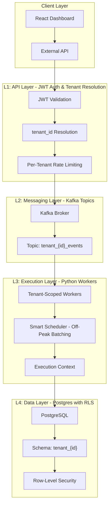
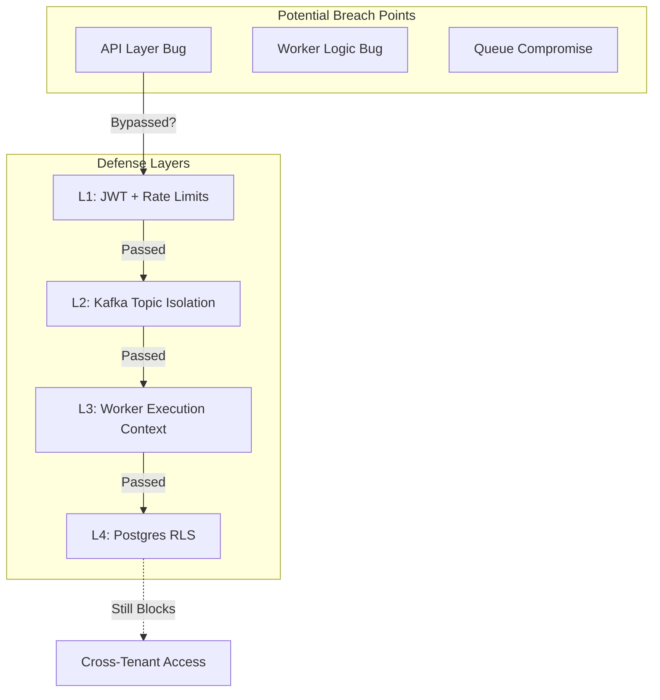
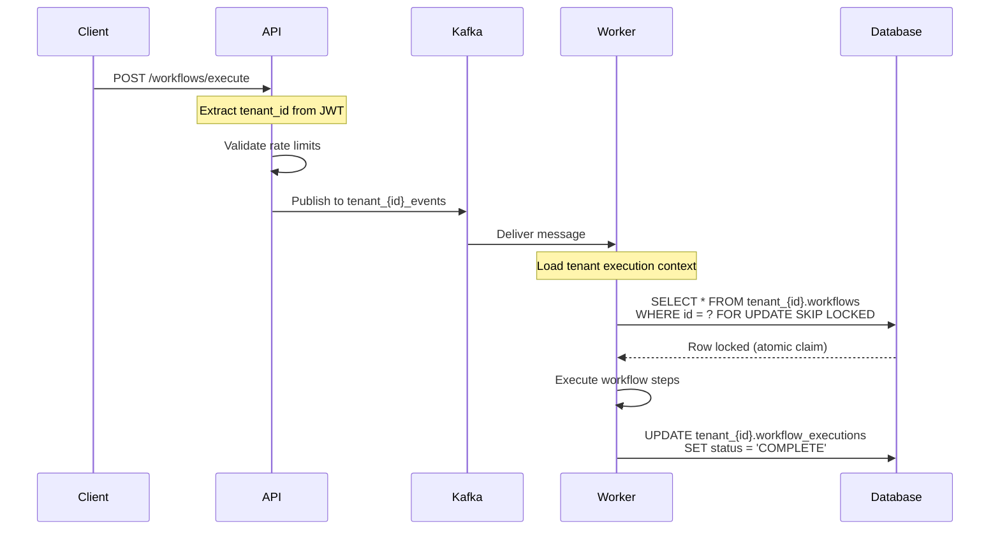

# EasyFlow Interview Guide

Complete interview preparation for the EasyFlow multi-tenant workflow automation system.

---

## Part 1: The Core Pitch (Memorize These)

### 15-Second Elevator Pitch (Recruiter Screens)

> "EasyFlow is a multi-tenant workflow automation system I built with strict tenant isolation. Tenant identity is resolved at the API using JWTs and enforced end-to-end through Kafka, workers, and Postgres row-level security. The key design goal: preventing cross-tenant data access even under shared infrastructure."

### 30-Second Default Pitch (Hiring Manager / First Interview)

> "EasyFlow is a multi-tenant workflow automation system with defense-in-depth isolation. Tenant identity is resolved at the API using JWTs and propagated through Kafka topics, worker execution, and Postgres schemas with row-level security. I designed it so even if the API layer fails, the database still enforces tenant boundaries. We start with shared infrastructure for cost efficiency and only split into dedicated components when scale or compliance requires it."

### 2-Minute Deep Dive (System Design Follow-Up)

> "EasyFlow is an end-to-end multi-tenant workflow system I designed and built. Tenant identity is established at the API with JWTs and carried through Kafka, workers, and the database.
>
> Each tenant has isolated Kafka topics, workers always execute in a tenant-scoped context, and Postgres enforces isolation using separate schemas and row-level security.
>
> I intentionally kept infrastructure shared at first to reduce cost and operational overhead. The architecture allows clean separation later—dedicated databases, workers, or analytics pipelines—when scale, compliance, or enterprise requirements justify it.
>
> A real issue I ran into was analytics queries scanning too much operational data. Instead of over-indexing the OLTP database, I separated bulk analytics into a different execution path, keeping core workflows fast and safe."

---

## Part 2: Explaining to Anyone (Analogies)

### Level 1: The 5-Year-Old

> "Imagine you have a big toy box where lots of kids can store their toys. Each kid has their own special drawer inside the toy box. Even though they all share one big toy box, Kid A can NEVER take toys from Kid B's drawer. The toy box has special locks that make sure everyone stays in their own drawer. EasyFlow is like that toy box, but for computer programs instead of toys."

### Level 2: The Apartment Building

> "EasyFlow is like an apartment building. Each tenant has their own apartment (their data). Even though they share the same building, the hallway, the elevator, and the lobby, there are locks on each apartment door. The building manager gives each tenant a key (like a special badge/JWT) that only opens their own door. No matter what happens in the hallway, you can't get into someone else's apartment. EasyFlow makes sure every tenant stays in their own apartment, even if someone makes a mistake."

### Level 3: The Defensive House

> "Think of EasyFlow as a house with many rooms. Each room belongs to a different person. Every door has three locks: one on the hallway door, one on the room door, and one special lock that won't let you in unless the house says you're allowed. So even if someone picks the hallway lock, the room lock still stops them. EasyFlow has these same three layers of locks. If one lock breaks, the others still work."

### Level 4: The Restaurant Kitchen

> "EasyFlow is like a restaurant kitchen where many restaurants share the same kitchen space. Each restaurant has their own chef (worker), their own ingredients on their own shelf, and their own tickets (Kafka messages). The head chef (API) checks your badge when you enter and only gives you tickets for your restaurant. Even if you somehow got a ticket for another restaurant, the shelf lock (Postgres RLS) still won't let you grab their ingredients."

### Level 5: The Bank Vault

> "EasyFlow is like a bank where each customer has their own safe deposit box. You have a key (JWT) that the bank recognizes at the front desk. They write down which box is yours, and that information travels with you through every step—through the hallway, past the guards, into the vault. Even if you somehow got past the front desk, the safe deposit box itself has its own lock that only your key opens."

---

## Part 3: Architecture Diagrams

### 4-Layer Architecture

### Defense-in-Depth Model

### Request Flow Sequence

---

## Part 4: Hostile Interview Q&A

### Q: "What if the API has a bug that bypasses tenant checks?"

> "The database still enforces isolation through row-level security. A bad API call can't cross tenant boundaries. Isolation belongs at the database, not just the API."

### Q: "Why didn't you just use separate databases per tenant from day one?"

> "Cost and operational overhead. Shared infrastructure with hard isolation lets you move faster early, then split when there's real pressure—compliance, enterprise contracts, or noisy-neighbor risk."

### Q: "How do you prevent noisy neighbors?"

> "Tenant-scoped workers, Kafka topic partitioning, per-tenant rate limits, concurrency caps, and fair scheduling. Resource contention is isolated economically, not allowed to cascade."

### Q: "What happens if the queue fails?"

> "Async workflows pause, but correctness and isolation remain intact. The database is the source of truth. Requests either fail fast with retryable errors or persist intent for replay."

### Q: "Why do you use Kafka if queues aren't trusted?"

> "Queues optimize throughput but are never trusted for correctness. They decouple request handling from execution. If the queue is unavailable, we allow availability to drop rather than risk correctness or isolation."

---

## Part 5: Failure Modes & Cost

### Three Failure Classes

| Failure Type | Example | Response |
|--------------|---------|----------|
| **Throughput** | Queue down | Async pause, retryable errors, correctness intact |
| **Security** | RLS misconfig | Security regression, limited blast radius, audit detection |
| **Economic** | Noisy tenant | Rate limits, concurrency caps, fair scheduling |

### Execution Modes & Cost

| Mode | Trigger | Cost |
|------|---------|------|
| **Real-time** | User action | $0.004/exec |
| **Balanced** | Default | $0.0035/exec |
| **Eco** | Scheduled, off-peak | $0.003/exec (~25% cheaper) |

---

## Part 6: STAR Problem Example

**Situation:** Analytics queries were scanning millions of workflow records.

**Task:** Add analytics insight without degrading transactional performance.

**Action:** Moved aggregation to off-peak execution windows, scoped queries by tenant, enforced RLS, validated system stability under load.

**Result:** Analytics added without impacting OLTP or tenant isolation. Measured → constrained → validated. No over-engineering.

---

## Part 7: Key Sentences (Senior Signal)

Drop ONE of these if you need to sound seasoned:

- "Defense-in-depth matters because bugs don't respect abstractions."
- "Isolation belongs at the database, not just the API."
- "Shared infrastructure is fine as long as the blast radius is controlled."

---

## Quick Reference

| Depth | Time | Use Case |
|-------|------|----------|
| Elevator | 15 sec | Recruiter screens |
| Default | 30 sec | Hiring manager |
| Deep Dive | 2 min | System design |
| Hostile | Variable | Pushback handling |

---

*Practice with: `./interview_practice.sh` or `./interview_practice.sh --hostile`*
